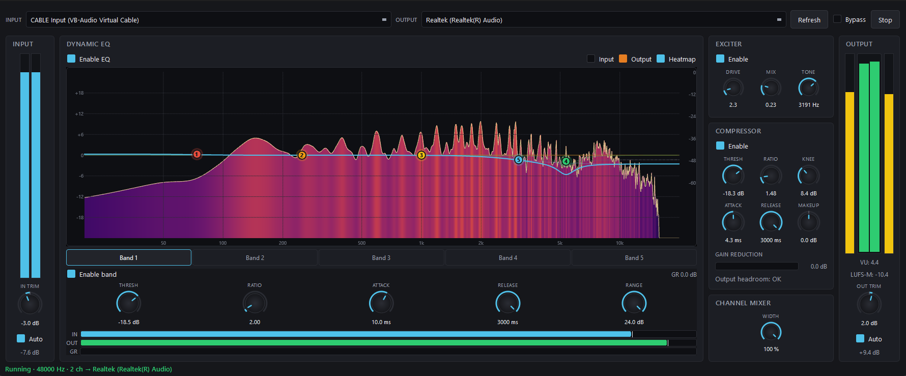

# TeeDSP

A user-space DSP host for Windows. Captures audio from any WASAPI render
endpoint via loopback, applies a real-time DSP chain (Parametric EQ →
Compressor → Exciter), and renders the result to another endpoint.

No kernel component. No APO. No elevation. No registry changes.



## Requirements

- Windows 10/11
- [VB-CABLE](https://vb-audio.com/Cable/) (or any other virtual audio cable)
  if you want to process system-wide audio. TeeDSP itself doesn't require it —
  you can also pipe any two real endpoints through it.
- Qt 6 (Core, Gui, Widgets)
- Visual Studio 2022 with the C++ workload (or any MSVC that can build Qt 6 apps)
- CMake 3.21+

## How it fits together

```
App → [Render device A] ──loopback──▶ TeeDSP ──▶ [Render device B] → speakers
                                       └ EQ → Comp → Exciter
```

Typical system-wide setup:

1. Install VB-CABLE. Set **CABLE Input** as your Windows default output.
2. Launch TeeDSP. Pick **CABLE Input (VB-Audio Virtual Cable)** as the capture
   source and your real speakers/DAC as the render target. Press **Start**.
3. Everything the system plays now routes through TeeDSP.

## Build

Qt 6 must be discoverable by CMake. If it is not in a standard location (the
usual case on Windows), copy `CMakeUserPresets.json.example` to
`CMakeUserPresets.json`, update the Qt path inside it, and substitute
`vs2022-local` / `vs2022-local-release` for the preset names below.

```
cmake --preset vs2022
cmake --build --preset vs2022-release --parallel
```

The executable is `TeeDsp.exe` in the build output directory.

## Settings

Persisted via `QSettings` — on Windows that's a per-user registry key under
`HKCU\Software\TeeDSP\TeeDSP`. Last-used capture/render devices and every DSP
parameter are saved on exit and restored on launch. No presets, no
configuration files to manage.
