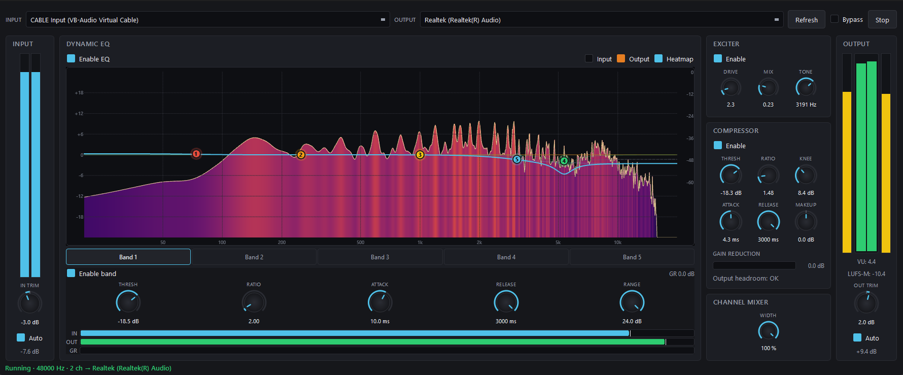

# TeeDSP

Real-time DSP on Windows and CM3588, with one processor and one Qt editor.
Windows runs the chain as a system-effects APO in `audiodg.exe`; CM3588 runs
it as a CLAP plugin on an AirPlay-to-PipeWire route. The Windows editor uses
shared memory, while the same editor runs in a browser via Qt WebAssembly and
HTTP. See [docs/architecture.md](docs/architecture.md) for the shared layers,
[apo/README.md](apo/README.md) for Windows, and [webqt/README.md](webqt/README.md)
for the browser editor.

> The user-space loopback bridge this README once described (capture from a
> virtual cable, process, re-render) was retired in commit `c09f22d` —
> VB-CABLE is no longer used or required.



## Requirements

- Windows 10/11
- Qt 6 (Core, Gui, Widgets)
- Visual Studio 2022 with the C++ workload (or any MSVC that can build Qt 6 apps)
- CMake 3.21+
- For the APO itself: Windows SDK (Inf2Cat/signtool) and the dev-signing setup
  described in [apo/driver/README.md](apo/driver/README.md); currently
  dev-signed only

## Windows audio path

```
Apps → audio engine (audiodg.exe: TeeDSP APO — EQ → Comp → Exciter) → endpoint
             ▲ params + heartbeat / meters + telemetry ▼
                    TeeDsp.exe editor (shared memory)
```

The APO loads persisted parameters from `C:\ProgramData\TeeDSP\params.bin` at
stream start, so processing works with the editor closed. Deployment goes
through the componentized driver package (`scripts\deploy-apo.ps1` for the APO,
`scripts\publish.ps1` for the editor) — see [apo/README.md](apo/README.md).

## CM3588 audio path

AirPlay from Music Assistant enters Shairport Sync and PipeWire, then the
TeeDSP CLAP host, then the UA-25 output. The browser editor at
`http://teedsp.local/` uses the same Qt controls and sends parameter changes
through the service API. See [linux/README.md](linux/README.md) for routing and
deployment.

## Windows build

Qt 6 must be discoverable by CMake. If it is not in a standard location (the
usual case on Windows), copy `CMakeUserPresets.json.example` to
`CMakeUserPresets.json`, update the Qt path inside it, and substitute
`vs2022-local` / `vs2022-local-release` for the preset names below.

```
cmake --preset vs2022
cmake --build --preset vs2022-release --parallel
```

The executable is `TeeDsp.exe` in the build output directory.

## Settings

Persisted as they change (never only on exit): UI state via `QSettings`
(per-user registry key `HKCU\Software\TeeDSP\TeeDSP`), and the DSP chain
baseline atomically to `C:\ProgramData\TeeDSP\params.bin`, which the APO
reads at stream start so settings apply even with the editor closed.
